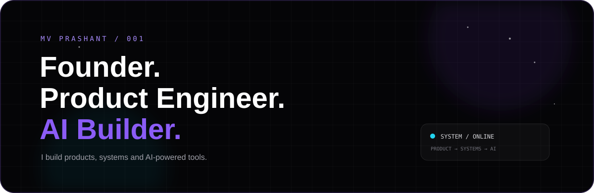

<!-- ========================================================================= -->
<!-- GENERATED WITH KRUMOS PROFILEBUILDER (REAL-TIME LIVE GITHUB TELEMETRY)      -->
<!-- Visual Skin: Cyberpunk Neon (Electric cyan & hyper yellow HUD) -->
<!-- ========================================================================= -->

  

 

  

 

  

 

  

 

  

 

  

 

---

### 🤝 Let's Build Something Together

Open to thoughtful collaboration, ambitious products, and impactful open-source initiatives.

- 🐙 **GitHub**: [@Singh-Shashvat](https://github.com/Singh-Shashvat)
- 💼 **Connect**: [Reach out on GitHub](https://github.com/Singh-Shashvat)

---

  ⚡ Crafted with <a href="https://github.com/krumos">Krumos ProfileBuilder</a> • Visual Skin: <code>Cyberpunk Neon</code>

