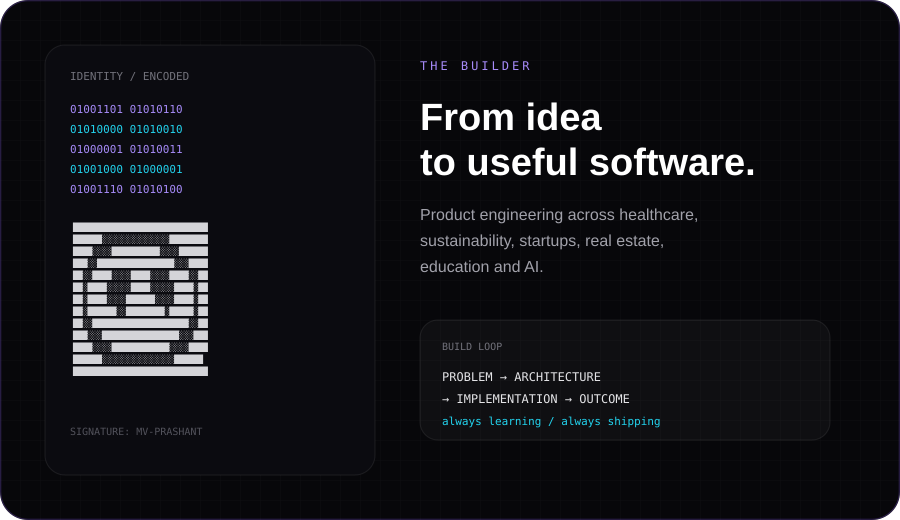

<div align="center">


<br/>

<a href="https://github.com/MvPrashant"></a>
<a href="#connect"></a>

</div>

<br/>

<div align="center">

> **“The goal isn't to use more technology.**  
> **The goal is to build something worth using.”**

</div>

---

## `01 / IDENTITY`



<br/>

<div align="center">

**Founder · Product Engineer · AI Builder**

I work across **product engineering, application architecture, frontend, backend, APIs, databases, SaaS systems and AI-powered developer tooling**.

Currently building at **Krumos**, turning ideas into products that people can actually use.

</div>

---

## `02 / TECHNOLOGY`

<div align="center">

### LANGUAGES


### PRODUCT / FRONTEND


### BACKEND / DATA


### CLOUD / SYSTEMS


</div>

---

## `03 / BUILD LOG`

> **Different industries. Different problems. One continuous journey of building software.**

### `01` · HEALTHCARE

#### FourC Health
**Healthcare Management Platform · United States**

A digital healthcare ecosystem focused on personalized primary care and weight management.

**Worked across**
- Patient mobile application
- EHR application for medical professionals
- Administrative application
- Healthcare workflows
- Scalable application architecture

**Stack**  
`React Native` `MongoDB` `AWS`

---

### `02` · CIRCULAR ECONOMY

#### Rebound
**Recycling & Sustainability Platform · UAE**

End-to-end software supporting recycling operations, material recovery and sustainability tracking.

**Worked across**
- Material recovery workflows
- Recycling operations
- Sustainability tracking
- Partner integrations
- Real-time data

**Stack**  
`React` `Node.js` `PostgreSQL` `AWS`

---

### `03` · STARTUP ECOSYSTEM

#### Ignyte
**Startup Growth Platform · DIFC**

A platform connecting founders, investors and service providers within the DIFC startup ecosystem.

**Worked across**
- Community networking
- Startup resources
- Business services
- Digital marketplace
- Authentication
- API integrations

**Stack**  
`React Native` `TypeScript`

---

### `04` · REAL ESTATE / DATA

#### Xtend
**Real Estate Data Platform · DIFC**

A subscription-based platform providing access to real estate data through APIs.

**Worked across**
- Subscription workflows
- API access
- Payment integration
- MFA
- RBAC
- Data protection
- Enterprise integrations

**Stack**  
`React` `Node.js` `TypeScript` `Azure`

---

### `05` · EDUCATION / SaaS

#### EduPro
**Education · SaaS · Product Platform**

A product direction focused on building software for education operations and student journeys.

**Areas**
- Student management
- Admissions
- CRM workflows
- Courses
- Payments
- Organization management
- Roles & permissions
- Analytics
- Integrations

**Stack**  
`React` `TypeScript` `Node.js` `PostgreSQL` `Docker`

---

### `06` · AI / DEVELOPER TOOLS

#### AI PR Reviewer
**AI · GitHub · Developer Automation**

An exploration into AI-powered engineering workflows around GitHub pull requests and automated code review.

**Areas**
- GitHub integrations
- LLM-powered analysis
- Automated code review
- Developer feedback
- AI workflows
- Model routing
- Engineering automation

---

## `04 / ENGINEERING MINDSET`

<div align="center">

```text
                    PROBLEM
                       │
                       ▼
                    CONTEXT
                       │
                       ▼
                  TRADE-OFFS
                       │
                       ▼
                  ARCHITECTURE
                       │
                       ▼
                 IMPLEMENTATION
                       │
                       ▼
                    OUTCOME
```

### I don't collect technologies.
### I understand why they belong in a system.

**Less technology for technology's sake.  
More thoughtful product engineering.**

</div>

---

## `05 / THE LAB`

| EXPERIMENT | DIRECTION |
|---|---|
| `AI AGENTS` | Systems that coordinate tools, services and actions |
| `AI DEVTOOLS` | GitHub, pull requests, code review and engineering automation |
| `AI MANAGER` | Model routing, tool selection, execution, verification and human approval |
| `MCP` | Connecting intelligent systems to real tools and services |
| `WEBGL` | Three.js, interactive interfaces and cinematic web experiences |

### AI Manager — the long-term idea

```text
USER
  ↓
AI MANAGER
  ↓
CHOOSE MODEL / TOOL / CONNECTOR
  ↓
PERFORM ACTION
  ↓
VERIFY RESULT
  ↓
RETURN RESULT + PROOF
  ↓
HUMAN APPROVAL WHEN REQUIRED
```

---

## `06 / GITHUB PULSE`

<div align="center">

<a href="https://github.com/MvPrashant">
  
</a>
<a href="https://github.com/MvPrashant">
  
</a>

<br/><br/>

<a href="https://github.com/MvPrashant">
  
</a>

</div>

> **For exact lifetime PR-created and PR-merged totals, use a GitHub API-backed SVG rather than hard-coding numbers.**

---

## `07 / CONTRIBUTION MISSION`

<div align="center">


<br/>

`CONTRIBUTION GRID // LIVE ACTIVITY // MISSION IN PROGRESS`

</div>

---

## `08 / BEYOND CODE`

**PRODUCT**  
What are we actually building?

**USERS**  
Who is this solving a problem for?

**ARCHITECTURE**  
How should the system behave as it grows?

**DELIVERY**  
Can we actually ship it?

**ITERATION**  
What did we learn after shipping?

> **Code is the implementation.  
> Product thinking is the direction.**

---

<a name="connect"></a>

## `09 / CONNECT`

<div align="center">

### BUILDING SOMETHING INTERESTING?

If you're working around **software, products, AI or developer tooling**, let's connect.

<br/>

<a href="https://github.com/MvPrashant"></a>
<a href="https://www.linkedin.com"></a>

</div>

---

<div align="center">


</div>
