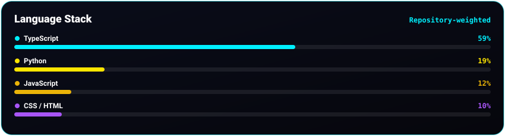
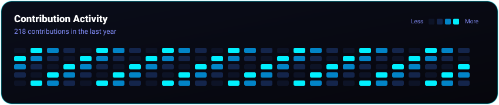

---

### SVG Rendering Test

If the banner above is visible, GitHub can render the SVG correctly.

If it is **not visible**, the problem is with `hero.svg` itself or GitHub's handling of that SVG.

---

### Other profile graphics

